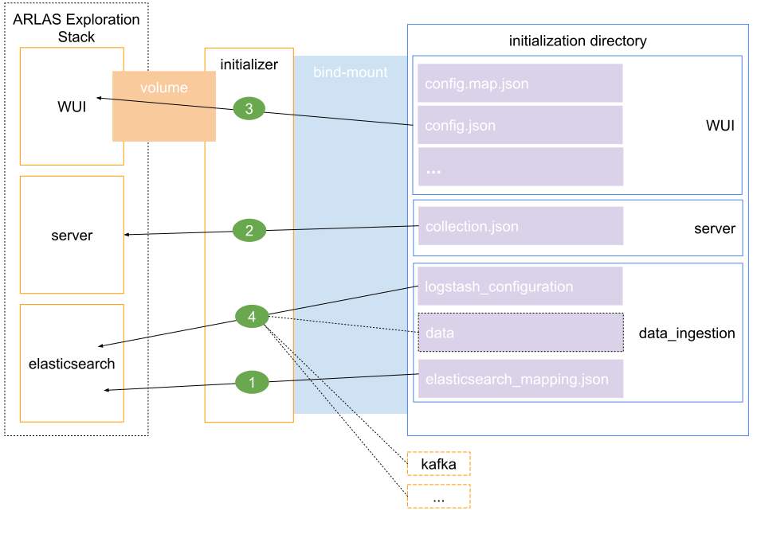

The ARLAS Exploration Stack Initializer aims at allowing to register data in the ARLAS Exploration Stack in an easy way. It comes under the form of a [docker](https://docker.com) container.

repository: https://github.com/gisaia/ARLAS-Exploration-stack/tree/master/arlas-exploration-stack-initializer

# Prerequisites

- [Docker CE](https://docs.docker.com/install/) (Community Edition)

# Build

@ [the repository's root](https://github.com/gisaia/ARLAS-Exploration-stack/tree/master):

```bash
cd arlas-exploration-stack-initializer; docker build -t gisaia/arlas-exploration-stack-initializer .; cd -
```

# Usage

Once you have ARLAS Exploration Stack running, you can use the initializer to register data into it. The initializer container is an instance of image: `gisaia/arlas-exploration-stack-initializer`.

To be used, it requires to be provided with a certain set of files presented in the table below. We have implemented an initialization of ARLAS with [AIS](https://en.wikipedia.org/wiki/Automatic_identification_system) data (ships) around Denmark, and the corresponding files are given as examples in the table.

| File name | Description | Example: ais-danmark |
|-|-|-|
| `data_ingestion/data` | File containing your data (csv, ...). | [data_samples/ais-danmark/data_ingestion/data](https://github.com/gisaia/ARLAS-Exploration-stack/blob/master/data_samples/ais-danmark/data_ingestion/data) |
| `data_ingestion/elasticsearch_mapping.json` | Mapping for the elasticsearch index. In this file, it is required to define a property of type `geo_point` where you should store latitude & longitude. | [data_samples/ais-danmark/data_ingestion/elasticsearch_mapping.json](https://github.com/gisaia/ARLAS-Exploration-stack/blob/master/data_samples/ais-danmark/data_ingestion/elasticsearch_mapping.json) |
| `data_ingestion/logstash_configuration` | Logstash configuration file for indexing the data set into elasticsearch. | [data_samples/ais-danmark/data_ingestion/logstash_configuration](https://github.com/gisaia/ARLAS-Exploration-stack/blob/master/data_samples/ais-danmark/data_ingestion/logstash_configuration) |
| `server/collection.json` | Collection to create in the ARLAS server. This file should respect requirements stated in [the documentation](http://arlas.io/arlas-tech/current/arlas-collection-model/). | [data_samples/ais-danmark/server/collection.json](https://github.com/gisaia/ARLAS-Exploration-stack/blob/master/data_samples/ais-danmark/server/collection.json) |
| `WUI/config.json` | WUI configuration file specifically crafted for your set of data. Documentation [here](http://arlas.io/arlas-tech/current/arlas-wui-configuration/). | [data_samples/ais-danmark/WUI/config.json](https://github.com/gisaia/ARLAS-Exploration-stack/blob/master/data_samples/ais-danmark/WUI/config.json) |
| `WUI/config.map.json` | Additional WUI configuration, relative to the styles of data-layer you want to show on the map. Documentation [here](http://arlas.io/arlas-tech/current/arlas-wui-configuration/). | [data_samples/ais-danmark/WUI/config.map.json](https://github.com/gisaia/ARLAS-Exploration-stack/blob/master/data_samples/ais-danmark/WUI/config.map.json) |

Instructions:
  - create a directory
  - inside this initialization directory, create the configuration files & write them. The initializer detects the files by their path & name, so be sure to respect the directory structure & the nomenclature of the files.
  - run the initializer with the initialization directory [bind-mounted](https://docs.docker.com/storage/bind-mounts/) onto it.

This a diagram explaining roughly what the initializer will do upon being triggered:



1. Creation of elasticsearch index
2. Indexation of data in elasticsearch using logstash. Data can come from anything that can be plugged into logstash (file, kafka topic, ...)
3. Creation of the collection in the ARLAS server
4. Injection of WUI configuration
5. Injection of WUI map configuration

## Configuration

The ARLAS Exploration stack initializer can be configured through environment variables.

| Name | Default value | Description |
|-|-|-|
| elasticsearch | `http://arlas-exploration-stack-elasticsearch:9200` | URL to the HTTP port of the elasticsearch server (`http://<hostname or IP>:<HTTP port>`). To be used only if you are not working with the elasticsearch server deployed by the manager. |
| elasticsearch_index | `arlas-data` | Name of the elasticsearch index where your data will be indexed. |
| elasticsearch_user | | Username for connection to elasticsearch. To be used only if you are not working with the elasticsearch server deployed by the manager. |
| elasticsearch_password | | Password for connection to elasticsearch. To be used only if you are not working with the elasticsearch server deployed by the manager. |
| server_collection_name | `data` | Name of the ARLAS server collection to create. |
| server_URL_for_initializer | `http://arlas-exploration-stack-server:9999` | Arlas server URL for the initialization container (`http://<hostname or IP>:<port>`). |
| server_URL_for_client | `http://localhost:9999` | Arlas server URL for the client (`http://<hostname or IP>:<port>`). |

## Example: ais-danmark

Example of initialization with the AIS data around Denmark provided in the repository (*Estimated time: 2mn*).

@ [the repository's root](https://github.com/gisaia/ARLAS-Exploration-stack/tree/master):

```bash
docker run \
  -e elasticsearch_index=ais-danmark \
  -e server_collection_name=ais-danmark \
  -i \
  --mount dst="/initialization",src="$PWD/data_samples/ais-danmark",type=bind \
  --mount type=volume,src=default_wui-configuration,dst=/wui-configuration \
  --net arlas \
  --rm \
  -t \
  gisaia/arlas-exploration-stack-initializer
```